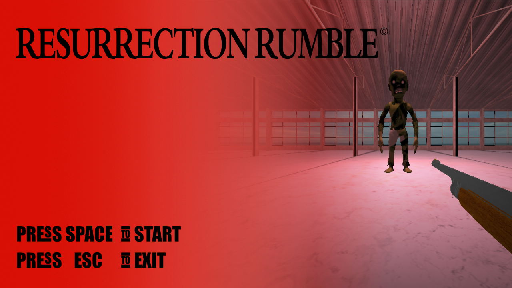
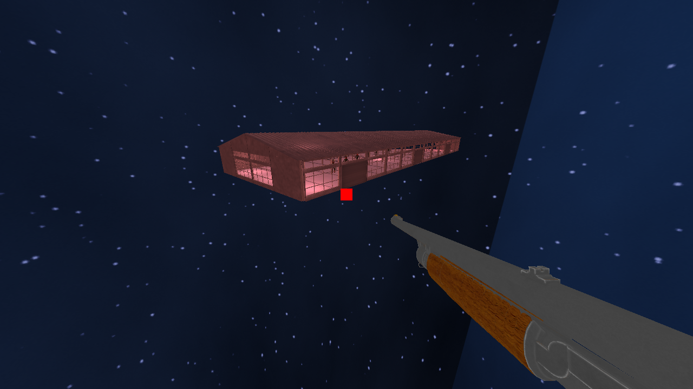
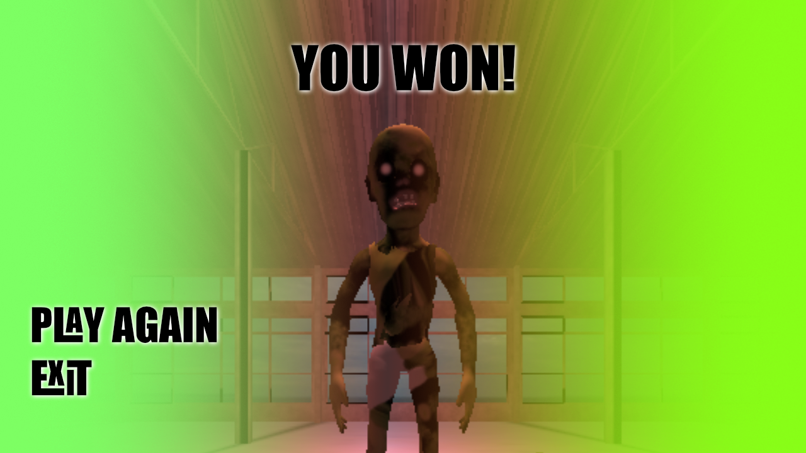
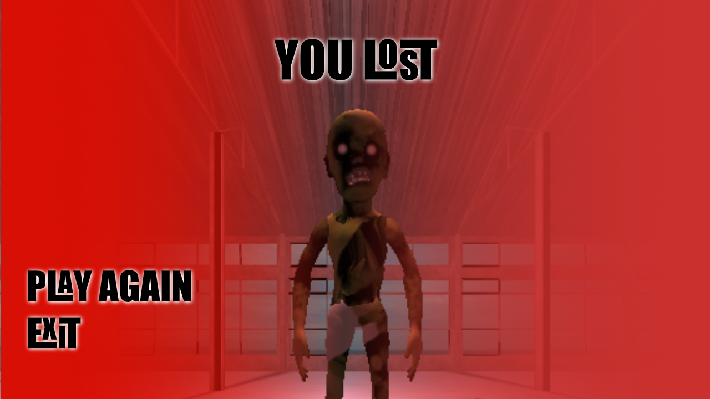

# Resurrection Rumble

Welcome to a world plunged into chaos, where the dead have risen, and humanity fights for its very survival. In "Resurrection Rumble," you'll navigate through three intense states that will test your skills, strategy, and nerves.

## Menu State



At the outset, the game offers a simple yet ominous menu. Choose your fate with the "Start" button as you embark on a journey through the apocalyptic landscape.
If the fear becomes too overwhelming, the "Exit" button allows a swift retreat to the safety of the real world.

## Play State




Once you've mustered the courage to face the undead, you find yourself armed and alone in a desolate city. Your mission is clear: eradicate every zombie in your path without succumbing to their relentless onslaught. Armed with a trusty firearm, your survival depends on your accuracy, agility, and strategic thinking. The objective is simple - kill all zombies before they lay their cold, decaying hands on you.

## Exit State




As the last echo of gunfire fades, you find yourself at a crossroads. In the aftermath, two buttons beckon – one for those eager to dive back into the fray and challenge the undead once more, and another for those who accept defeat and choose to exit the nightmarish realm.

## Sounds On!

Get ready for an auditory rollercoaster in "Resurrection Rumble" that will have your heart pounding in sync with the relentless beat of the undead horde.
The soundtrack of this apocalyptic symphony blends eerie moans, distant screams, and bone-chilling growls, creating an immersive atmosphere of terror. Gunshots through the abandoned warehouse, punctuating the air with the percussive rhythm of survival. The zombies' guttural groans and the occasional spine-chilling screech provide an unsettling harmony to the chaos. Brace yourself for the adrenaline-fueled soundscape that adds layers of excitement, fear, and exhilaration to the Resurrection Rumble experience, making every encounter with the undead a thrilling dance between life and death.

## Conclusions

Whether you emerge as the triumphant survivor or fall victim to the relentless tide of the undead, "Resurrection Rumble" provides an adrenaline-pumping experience that will leave you questioning your survival instincts.
Can you outwit the dead and defy the odds? The choice is yours.

---

# How to Play

## Installation

1. Open the terminal and Clone the repository to your local machine.
2. Navigate to the project directory.

```bash
git clone https://github.com/ahmedtarekabd/Computer-Graphics-Project.git
cd Computer-Graphics-Project
```

3. Follow the following video to install the required libraries and tools - [Installation Video](https://www.youtube.com/watch?v=45MIykWJ-C4&t=82s)
   1. From [0:01:22](https://www.youtube.com/watch?v=45MIykWJ-C4&t=82s)
   2. To [0:06:36](https://www.youtube.com/watch?v=45MIykWJ-C4&t=396s)

## Running the Game

To compile the code, you need `CMake` and a `C++17` compiler. Thus, you **CANNOT** use an version of Visual Studio older than `Visual Studio 2017`. As alternatives, you can use `GCC 9` (or newer) or `CLang 5` (or newer).
If you are using `Visual Studio Code` with the `CMake Tools` extension, you should find the `GAME_APPLICATION.exe` inside the folder `bin`.

1. Open the terminal and navigate to the project directory.
2. You should run the executable using a terminal from the project folder where the execution command will be:
   1. This will run the application using the default configuration file `config/app.jsonc`.

```bash
./bin/GAME_APPLICATION.exe
```

3. To run another configuration (e.g. `config/app.jsonc`), you should execute the command:

```bash
./bin/GAME_APPLICATION.exe -c='config/app.jsonc'
```

4. **Enjoy the game!**
